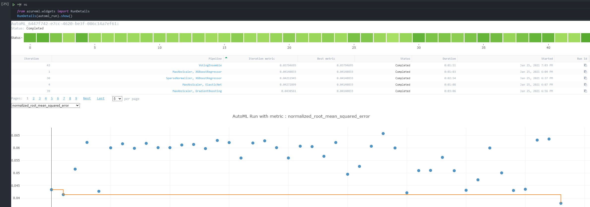
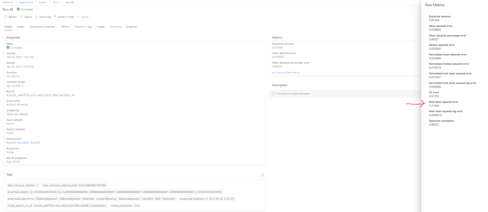
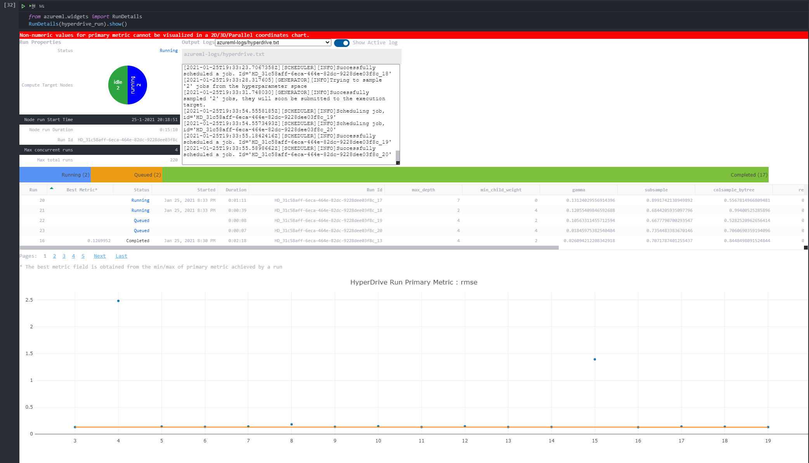
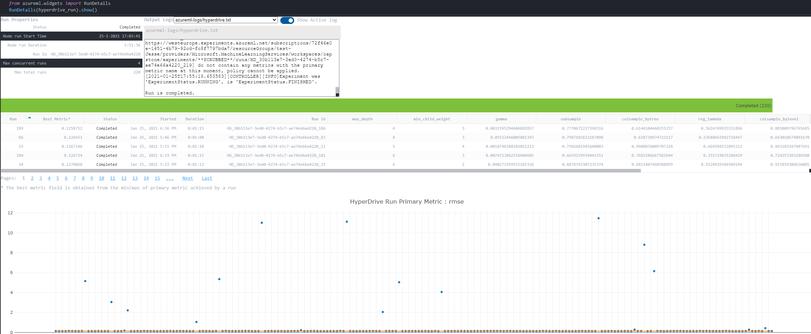
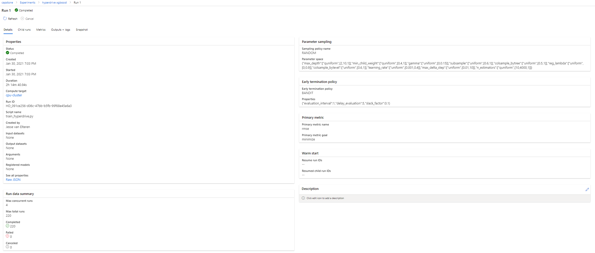
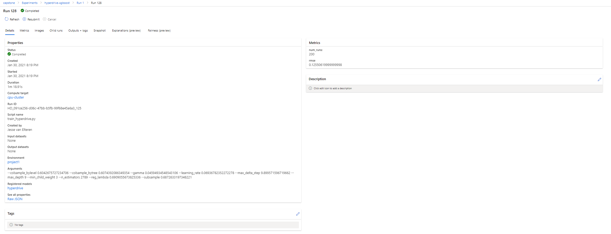
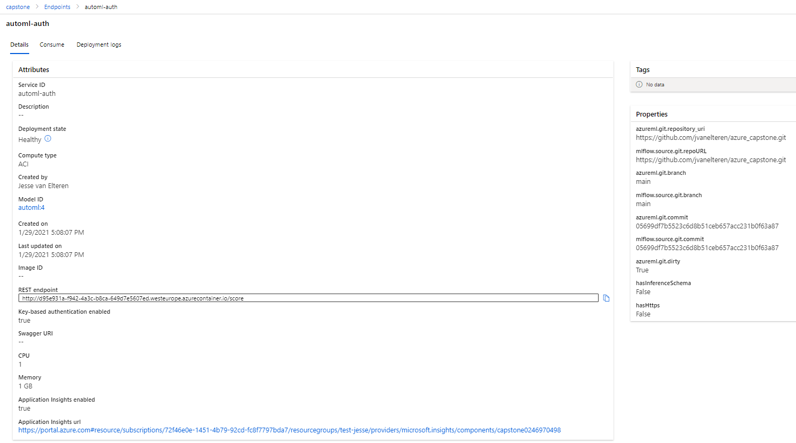

# Kaggle housing project with Azure

For this capstone project, I wanted to find out how good hyperdrive and AutoML are performing. As a benchmark I've taken the [https://www.kaggle.com/c/house-prices-advanced-regression-techniques/overview](Kaggle housing competition), a competition where I participated myself and spend quite some time. The goal of the competition is to predict the price of a house given certain features. The benchmark is my personal submission (0.117), which scores top 3%. If either the AutoML or Hyperdrive model is outperforming that, it indicated Azure is a very good platform for machine learning models.

## Project Set Up and Installation
I decided to perform 4 experiments:
(1) AutoML on the original kaggle dataset. The target in the dataset was log transformed, since that was the strategy I used in the competition as well. 
Additionally I prepared a more elaborate dataset where additional feature engineering & selection was applied, which I used for my best score in the competition. This because feature engineering is a critical step in the ML process and I was pretty sure Azure could not come up with a good score without it. This dataset was run with AutoML (2), two XGBoost hyperdrive experiments: one with a randomsampling bandit policy (3) and one with bayesian sampling without a policy (4)

## Dataset
As stated, I generated two datasets for training. The original dataset with only a log transform was stored as a [csv file at github](https://raw.githubusercontent.com/jvanelteren/housing/master/datasets/original_kaggle_y_log.csv)The more elaborate dataset was prepared by me by running the feature engineering notebook in my competition repo. It generated a [CSV file](https://raw.githubusercontent.com/jvanelteren/housing/master/datasets/housing_after_preprocessing.csv). This CSV file was then imported using the Azure Python SDK (udacity-project.ipynb). During training with hyperdrive, the dataset was split in a train dataset including the variable of interest y and a test dataset where the target variable was not present.
Note that the two datasets have same amount of rows and the target for each house is identical.

### Overview
I've split the main steps into separate notebooks
1) train_models.ipynb registers the dataset and trains automl and hyperdrive models
2) register_model.ipynb inspects the overview of the model scores and registers the best performing model in the workspace
3) deploy_test_endpoint deploys the best scoring model and tests it's endpoint

### Task
As discussed, the more advanced dataset is already enriched by all kinds of feature engineering, e.g. combining existing features into sums, transforming features into ordinal variables, taking log transforms etc. In addition a custom Boruta algorithm was executed to take a subset of features. No scaling of features did take place yet.
The task of the algorithm is regression: to predict the housing price, which is denoted as variably 'y' in the datasets.

### Access
The csv files are publicly accessable. The train CSV file was converted into a TabularDataset and registered in the workspace (train_models.ipynb)

## Automated ML
As denoted, two AutoML runs where executed, with identical settings on two datasets. The AutoML settings used were:
- experiment_timeout_minutes=60 --> run the experiment for 1 hour. I chose this since I wanted to strike a balance between giving AutoML a fair amount of time to run, but also to continue with the learning for this course. Also longer running times imply higher cost & use of energy.
- enable_onnx_compatible_models=True --> to potentially deploy an onnx model at a later stage, e.g. for deployment on a different platform and devices like Android or ios. Onnx is an open standard for representing machine learning models](https://docs.microsoft.com/en-us/azure/machine-learning/concept-onnx).
- task='regression' --> this is a regression task. Other options are classification or forecasting, but that's not the case here.
- primary_metric='normalized_root_mean_squared_error' --> The Kaggle competition uses RMSE and this comes closest. The normalization is just dividing the RMSE by the range of the target. Azure will optimize the primary metric, but since the training set is always the same, optimizing the NRMSE will be the same as optimizing RMSE. In addition, Azure lists many other scores in the run details, so for comparing with hyperdrive I was able to simply pick the RMSE, since it is stored.
- training_data= train --> the train dataset. This includes both the features and the target. Since training_data is specified, the next parameter also must be specified.
- label_column_name='y'--> The name of our target variable, in this case the log of the house price. This is the value to predict.
- compute_target= cpu_cluster --> the compute cluster used. I used the same D2V2 config as the previous project. The tradeoff here is speed of the experiment versus cost. I did notice that most of my cost are coming from deployed endpoints and not the used compute, so could have taken a slightly faster CPU here. For this dataset it's overkill to use a GPU. Actually I don't know if it would even be of help for a regression task in general, GPU's are mostly used for text & vision applications.
- n_cross_validations=5 --> Cross validation was used for both hyperdrive as automl to set an equal playing field for both experiments. Splitting the dataset into a train and validation dataset would train on the train set and leave the validation set unused (only for scoring), whereas I understand cross-validation basically to make several train/validation splits (also known as folds), scores the trained models on their respecive validation sets, saves the score and afterwards trains a final model on the full dataset. This dataset is quite small, therefore I chose cross validation to be able to use the full train dataset for training.

A reviewer informed me about [a very useful link](https://docs.microsoft.com/en-us/python/api/azureml-train-automl-client/azureml.train.automl.automlconfig.automlconfig?view=azure-ml-py) about AutoML settings
### Results
AutoML scored a RSME of 0.1167 on the engineered dataset and 0.1273 on the raw dataset, both using a voting ensemble. This was more or less expected, since as a rule of thumb an ensemble of models gives a slight improvement in score. It could be further improved by e.g. getting more data, additional feature engineering (although one of the datasets is already pretty much engineered out) and further finetuning the model. An other alternative is to try deep learning, but I noticed Azure doesn't offer that option for regression.
Screenshot of rundetails widget. It shows that the best model is found at the last run, which is where the ensembling takes place.

Screenshot of the best model. I've highlighted the RMSE, which is provided under 'view other metrics'. In addition the tags show which models are included in the ensemble.

## Hyperparameter Tuning
The question for hyperparameter tuning is of course which model to choose. Since I already ran AutoML, it made sense to me to try to improve that result even further with Hyperdrive. Seeing the top results from AutoML, I decided to keep it managable by excluding the VotingEnsemble, but take the second best model (which was XGBoost) and try to improve that further with Hyperdrive. I used all the parameters that I've also used in my previous Kaggle submission to define the hyperparameter search space. The ranges where empirically determined by much googling for other ranges used for XGBoost and are stated in train_models.ipynb.

The config settings used where chosen such that the running time of the experiment would end up being somewhat similar to running the experiment for an hour. Since I was especially interested in the difference between randomparameter sampling and bayesian sampling, I ran two experiments. Additionally, for the random parameter sampling experiment, I specified a bandit policy to make sure the experiment would stop if the scores would not be increasing.

After my first run with Hyperdrive, I inspected the parallel plot for the best results and increase the ranges somewhat when the best runs where close to the edges of the search space.

### Results and comparison with AutoML
AutoML on same dataset as hyperdrive	                    0.1167 (best run: VotingEnsemble)
AutoML on original dataset (except log transform target)	0.1248
Hyperdrive xgboost with bandit policy	                    0.1255 
Hyperdrive xgboost with bayesian sampling	                0.1270
AutoML on same dataset as hyperdrive	                    0.1273 (second best run: XGBoost)

The both hyperdrive runs were quite close and did both improve the score of the AutoML XGBoost model. However, overall two AutoML Voting ensemble model performed best . I was really surprised to see the AutoML model on the original dataset perform so well! Apparently there is some good feature engineering happening in the AutoML pipeline.

The parameters of the best Hyperdrive model where:
--colsample_bylevel 0.8850097967656851 --colsample_bytree 0.6144104460255237 --gamma 0.0031595294406882857 --learning_rate 0.11537429336238596 --max_delta_step 9.453102902399772 --max_depth 4 --min_child_weight 3 --n_estimators 1439 --reg_lambda 0.5624749925551896 --subsample 0.7770671217398316

This score could be futher improved by making it into an ensemble with other models, or trying out different scaling options.

I've included two screenshots, one of a run with bayesian sampling just starting, one with a run with random sampling being almost finished. The random sampling has more runs, but both runs have certain experiments with a very bad score, which leads to outliers in the graph

Screenshot of the completed run with random sampling. 

Screenshot of the best model

## Model Deployment
I've registered the best model from AutoML and hyperdrive and deployed the AutoML model.

The AutoML model had the best score, so that was deployed (deploy_test_endpoint.ipynb). It can be queried using a the HTTP endpoint. For this project I've tried out batch inference, to run inference on many houses at once. This feature enabled me to fill in the final test dataset and submit it to Kaggle. The final score of the AutoML model on the private testset was 0.1258. The difference with the training score is that this competition has a fairly low amount of datapoints, which could lead to some inadvertent overfitting on the training set.

The model can be queried my loading a dataset with houses into pandas. Of course it needs to have the same columns the model was trained on. This dataset should then be converted into JSON and submitted to the HTTP endpoint. The endpoint converts this json back into a dataframe and submits to the model. The model returns a Numpy array (for all houses 1 prediction). Then, these predictions are converted into a list, converted to json and returned to the sender.

Screenshot of deployed active endpoint

The rubric also stated I should register the best hyperdrive experiment. Unfortunately, during training I used xgb.cv for cross validation, which only returns the score and not the model. Therefore I had to rerun the full experiment where I made sure to save an xbgboost regressor if the score of xbg.cv was good enough. The registering of this model was also done in register_model.ipynb.

## Future improvements
The best score could be improved in multiple ways:
- By getting more data. It would be quite difficult to obtain but many times the answer to a better score is to get more data.
- By trying out different preprocessing options. Combined with changing this project into a pipeline(see below) that would make it easy & awesome to run several experiments with slightly different datasets. Could also end up costly by the way.
- An other alternative is to try deep learning, but I noticed Azure doesn't offer that option for regression, so you would have to code it manually
- By adding another layer of stacking of models on top of the voting ensemble

The project itself could be improved in multiple ways:
- Change the project into a pipeline which makes it possible to train/deploy automatically when new training datasets are supplied
- Change the REST endpoint such that it returns a csv file which is ready for submission to Kaggle
- By further trying to understand the discrepancy between performance on the train set and performance on the testset. In the end however it would lead to overfitting on the test set by making submissions to Kaggle. Which is nice for the leaderboard score, but not for the models' ability to generalize

## Screen Recording
I've made a screen recording, which is posted here [https://youtu.be/-JEsBgIKx60](https://youtu.be/-JEsBgIKx60)